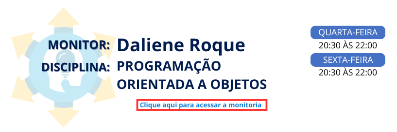

<div align="center">

# Monitoria de Programação Orientada a Objetos (POO) - Java

### Programa Ampliar • Unicesumar • Módulo 54 em 2026 • Projeto Prático: Jogo de Corrida




**Aprenda Programação Orientada a Objetos em Java desenvolvendo um jogo de corrida do zero!**

</div>

---

## 📚 Sobre este repositório

Este repositório reúne os **materiais, códigos, exercícios, desafios e atividades práticas** desenvolvidos durante as monitorias de **Programação Orientada a Objetos (POO) em Java — Módulo 54** do Programa Ampliar da Unicesumar.

Neste módulo, a proposta será aprender POO de uma forma **prática, progressiva e baseada em um projeto**.

**O projeto principal será a construção de um jogo de corrida em Java.**

Ao invés de apresentar todos os conceitos de POO apenas de forma teórica, cada novo conceito será introduzido a partir de uma necessidade do próprio jogo.

Durante o desenvolvimento, os alunos irão aprender como utilizar:

- Classes e Objetos;
- Atributos;
- Métodos;
- Construtores;
- Encapsulamento;
- Herança;
- Polimorfismo;
- Classes Abstratas;
- Interfaces;
- Relacionamento entre classes;
- Reutilização de código;
- Organização do código.

O objetivo é transformar os conceitos de POO em **funcionalidades reais dentro de um projeto de software**.

---

# 🔗 Continuidade do Módulo 53

O Módulo 54 dá continuidade aos estudos realizados no **Módulo 53**.

O repositório anterior possui materiais, exemplos, exercícios e conteúdos importantes que poderão ser utilizados como **base de consulta e revisão** durante esta nova etapa.

📚 **Acesse o repositório do Módulo 53:**

👉 [Programa Ampliar • Unicesumar • Módulo 53](https://github.com/dalieneroque/Programa-Ampliar-Unicesumar-2026-Modulo-53)

Os conhecimentos desenvolvidos anteriormente serão retomados e utilizados na construção do novo projeto.

A proposta do Módulo 54 é **evoluir a experiência prática**, utilizando um novo projeto para aplicar os conceitos de POO de maneira integrada.

> 📚 **Módulo 53** → Fundamentos, materiais e práticas iniciais  
>
> 🏎️ **Módulo 54** → Aplicação prática e desenvolvimento do Jogo de Corrida

---

# 🏎️ Projeto: Jogo de Corrida

O projeto principal das monitorias será o desenvolvimento de um **jogo de corrida em Java**.

A ideia é começar com uma estrutura simples e, ao longo das monitorias, adicionar novas funcionalidades.

O jogo será utilizado como um **laboratório de Programação Orientada a Objetos**, permitindo que cada novo recurso seja relacionado a um conceito aprendido.

---

## 🏁 Como será o jogo?

O jogador poderá participar de corridas utilizando diferentes veículos.

Durante o desenvolvimento, poderemos trabalhar com elementos como:

- 🏎️ Carros;
- 🏍️ Motos;
- 👤 Pilotos;
- 🏁 Corridas;
- 🛣️ Pistas;
- ⚡ Velocidade;
- ⛽ Combustível;
- ❤️ Resistência;
- 🏆 Classificação;
- ⏱️ Tempo de corrida;
- 🚦 Largada;
- 🥇 Pódio;
- 🛠️ Melhorias nos veículos;
- 🌧️ Condições da pista;
- 🎮 Sistema de pontuação.

As funcionalidades serão desenvolvidas gradualmente conforme os conteúdos das monitorias.

---

# 🧠 Aprendendo POO através do jogo

A proposta será fazer com que cada conceito de POO apareça naturalmente durante o desenvolvimento.

Por exemplo:

```text
Precisamos criar um carro
          ↓
  Criamos uma Classe
          ↓
 Criamos um Objeto Carro
          ↓
  Adicionamos atributos
          ↓
   Criamos métodos
          ↓
 Utilizamos construtores
          ↓
Protegemos os dados com encapsulamento
          ↓
Criamos diferentes tipos de veículos
          ↓
Utilizamos herança
          ↓
Alteramos comportamentos com polimorfismo
          ↓
Criamos estruturas abstratas
          ↓
Utilizamos interfaces
          ↓
Construímos o jogo completo
```

Dessa forma, o aluno não aprende apenas **o que é POO**, mas também **por que determinado conceito é necessário dentro de um projeto**.

---

# 🎯 Objetivos da monitoria

Durante o desenvolvimento do jogo, os alunos serão estimulados a:

- Compreender os fundamentos da Programação Orientada a Objetos;
- Desenvolver aplicações utilizando Java;
- Praticar lógica de programação;
- Criar e organizar classes;
- Trabalhar com objetos;
- Aplicar encapsulamento;
- Utilizar herança e polimorfismo;
- Compreender relacionamentos entre classes;
- Desenvolver código reutilizável;
- Resolver problemas através da programação;
- Trabalhar em um projeto desenvolvido de forma incremental.

---

# 🗂️ Cronograma das Monitorias

O cronograma poderá ser adaptado conforme o desenvolvimento do projeto e o ritmo das turmas.

| Etapa | Conteúdo / Desenvolvimento | Situação |
|:---:|---|:---:|
| 01 | Apresentação do projeto e ideia do jogo | Concluído |
| 02 | Classes e Objetos: criando os primeiros veículos | Concluído |
| 03 | Atributos e Métodos: características e ações | Em desenvolvimento |
| 04 | Construtores: criando veículos | Em desenvolvimento |
| 05 | Encapsulamento: protegendo os dados | Em desenvolvimento |
| 06 | Herança: diferentes tipos de veículos | Em desenvolvimento |
| 07 | Polimorfismo: comportamentos diferentes | Em desenvolvimento |
| 08 | Classes Abstratas | Em desenvolvimento |
| 09 | Interfaces | Em desenvolvimento |
| 10 | Sistema de largada e corrida | Em desenvolvimento |
| 11 | Sistema de classificação | Em desenvolvimento |
| 12 | Pontuação e evolução do jogo | Em desenvolvimento |
| 13 | Integração e apresentação do projeto | Em desenvolvimento |

> 📌 O cronograma poderá sofrer alterações de acordo com o andamento das monitorias.

---

# 📁 Organização do Repositório

```text
📦 Programa-Ampliar-Unicesumar-2026-Modulo-54-POO-Projeto-Pratico
│
├── 📂 Jogo-Corrida
│   │
│   ├── 📂 src
│   │   └── 📂 ...
│   │
│   ├── 📄 README.md
│   └── 📄 ...
│
├── 📂 Materiais
│
├── 📂 Exercicios
│
├── 📂 Desafios
│
└── 📂 Recursos
```

A estrutura poderá ser modificada conforme novas funcionalidades forem adicionadas ao jogo.

---

# 💻 Tecnologias utilizadas

- ☕ Java
- 💻 Visual Studio Code
- 🔧 Git
- 🐙 GitHub

---

# 🚀 Como utilizar este repositório

### 1️⃣ Acompanhe o projeto

Acesse a pasta:

```text
Jogo-Corrida
```

e acompanhe a evolução do projeto.

### 2️⃣ Estude o código

Observe como os conceitos de POO são aplicados nas diferentes partes do jogo.

### 3️⃣ Execute o projeto

Abra o projeto no **Visual Studio Code** e execute os códigos Java.

### 4️⃣ Modifique o jogo

Experimente realizar alterações


### 5️⃣ Resolva os desafios

Após cada etapa, novos desafios poderão ser propostos para colocar o conteúdo em prática.

### 6️⃣ Crie novas funcionalidades

Use sua criatividade para adicionar novas funcionalidades ao jogo.

---

# 🎯 Conceitos de POO aplicados ao projeto

O projeto será utilizado para trabalhar os principais conceitos de Programação Orientada a Objetos:

```text
                 🏎️ JOGO DE CORRIDA
                         │
                         ↓
                      CLASSES
                         │
                         ↓
                      OBJETOS
                         │
                         ↓
                     ATRIBUTOS
                         │
                         ↓
                      MÉTODOS
                         │
                         ↓
                    CONSTRUTORES
                         │
                         ↓
                  ENCAPSULAMENTO
                         │
                         ↓
                      HERANÇA
                         │
                         ↓
                   POLIMORFISMO
                         │
                         ↓
                CLASSES ABSTRATAS
                         │
                         ↓
                    INTERFACES
                         │
                         ↓
                  🏁 JOGO COMPLETO
```

---

# 💡 Metodologia

A metodologia será baseada em **aprendizagem prática, desenvolvimento incremental e resolução de problemas**.

Cada encontro seguirá, sempre que possível, uma sequência semelhante:

```text
🏁 Problema do jogo
        ↓
💭 Pensamento lógico
        ↓
📚 Conceito de POO
        ↓
💻 Implementação
        ↓
🏎️ Aplicação no jogo
        ↓
🧪 Testes
        ↓
🎯 Desafio
```

Assim, o aluno poderá acompanhar a evolução do projeto enquanto aprende os conceitos necessários para desenvolvê-lo.

---

# 🏆 Resultado esperado

Ao final das monitorias, os alunos terão participado da construção de um **jogo de corrida em Java**, aplicando conceitos fundamentais da Programação Orientada a Objetos.

Mais importante do que simplesmente finalizar o jogo será compreender **como as diferentes partes do sistema foram planejadas e implementadas**.

Durante o desenvolvimento, os alunos deverão ser capazes de responder perguntas como:

> **"Por que criamos essa classe?"**

> **"Qual é a responsabilidade desse objeto?"**

> **"Por que esse atributo pertence a essa classe?"**

> **"Quando devemos utilizar um método?"**

> **"Onde podemos utilizar herança?"**

> **"Como o polimorfismo pode ajudar nosso jogo?"**

> **"Como as classes se relacionam?"**

A proposta é transformar os conceitos de POO em **código funcionando, compreensível e aplicado a um projeto completo**.

---

# 🎥 Aulas da Monitoria

Acesse as aulas e materiais pelo link abaixo:

🔗 [Programa Ampliar — Programação Orientada a Objetos](https://sites.google.com/view/programa-ampliar/2026/tecnologia-532026/programa%C3%A7%C3%A3o-orientado-a-objetos)

---

<div align="center">

## 🏁 Bons estudos e boa corrida!

**"A melhor forma de aprender programação é programando."**

</div>

---

<div align="center">

[](https://www.linkedin.com/in/daliene-roque-a5b167269/)
[](https://github.com/DalieneRoque)
[](https://www.youtube.com/channel/UCzS1CS4ll7-4kWyIwYVhz9w)
[](https://discord.gg/5EsYDnNDky)
[](https://www.instagram.com/dalieneroque/)
[](https://linktr.ee/dalieneroque)

</div>

<div align="center">

**Daliene Nonato Lima Roque**

</div>